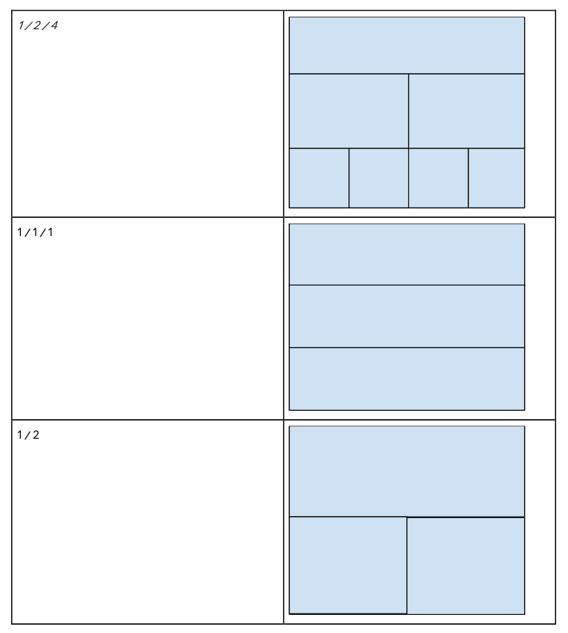

# react-native-layout-generator

## How it works
A simple **Layout Generator**. The input and output of your generator are as follows:
- **Input:** A string like `1 / 1 / 2`. The number presents the number of items in a row. You can find the
examples on the next page.
- **Output:** a layout based on the given value. Sample outputs are on the next page examples.
You should put the layout generator inside of a container that has a text input with layout-values. When the
user types a valid value, the layout will change in real-time. The inputs can be of infinite rows.

## Example outputs

    

## Contributing

Thank you for your interest in contributing! Please feel free to put up a PR for any issue or feature request.

## Give me a Star

If you think this project is helpful just give me a ⭐️ Star is enough because i don't drink coffee 😃

## License

This project is licensed under the MIT License - see the [LICENSE](https://github.com/moh3n9595/react-native-layout-generator/blob/master/LICENSE) file for details

## Author

Made with ❤️ by [Mohsen Madani](https://github.com/moh3n9595).